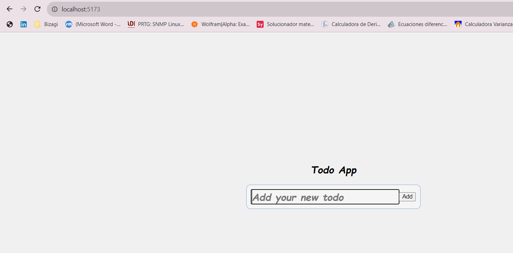
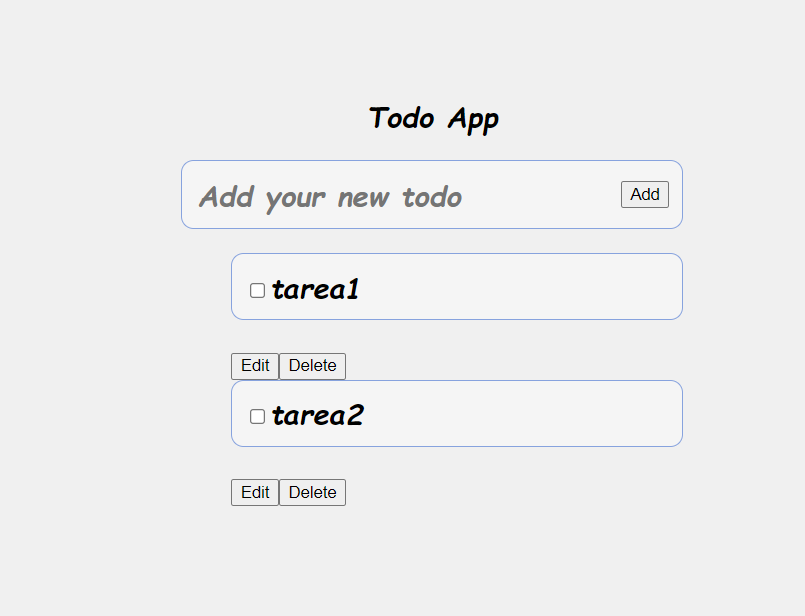
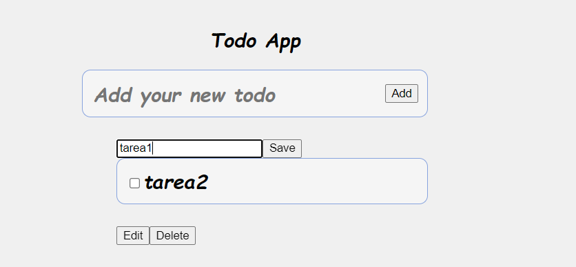
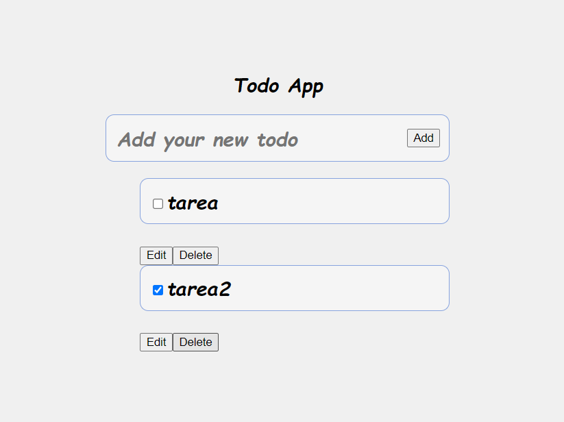
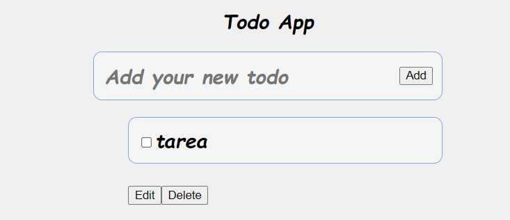
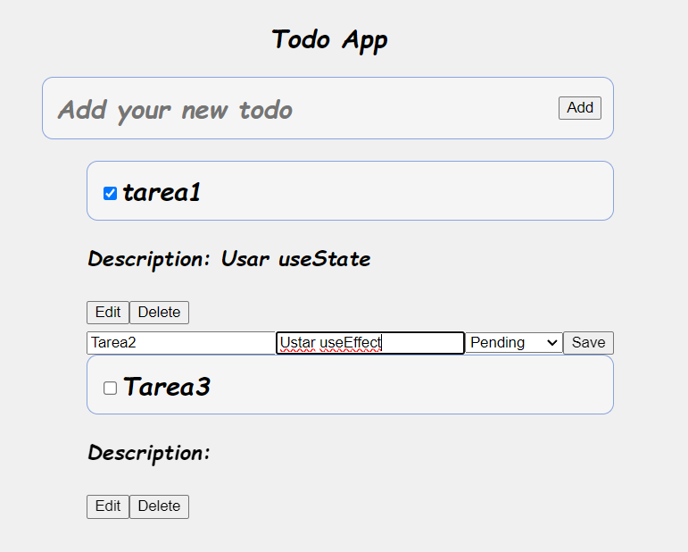
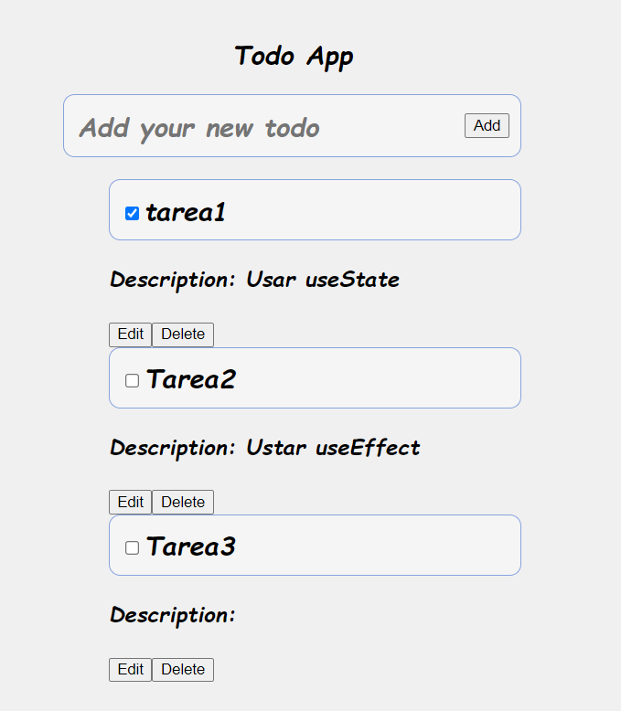
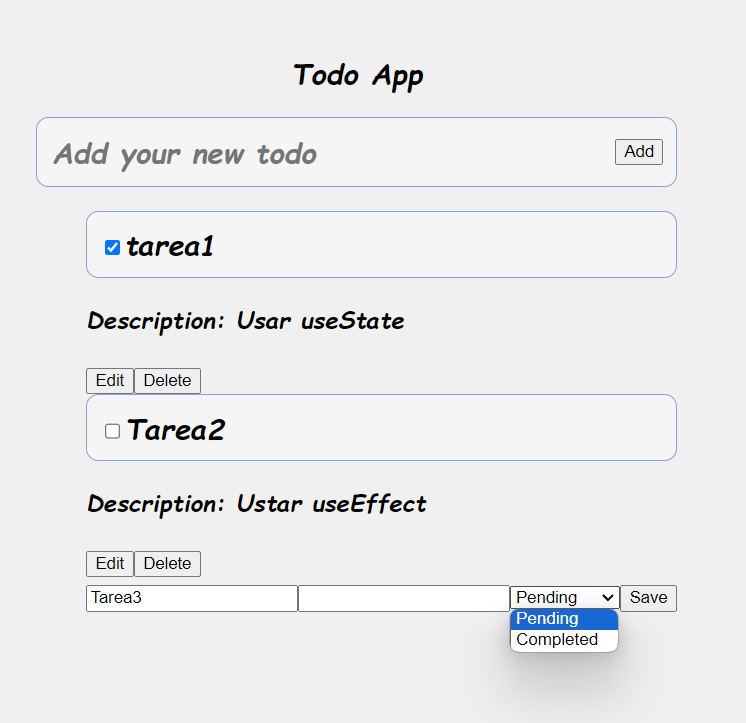
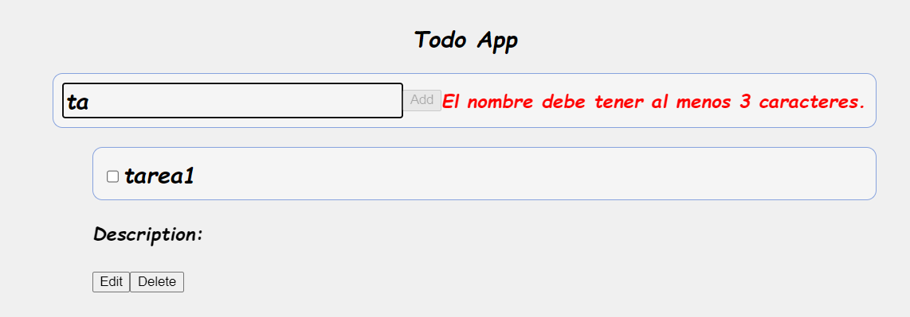
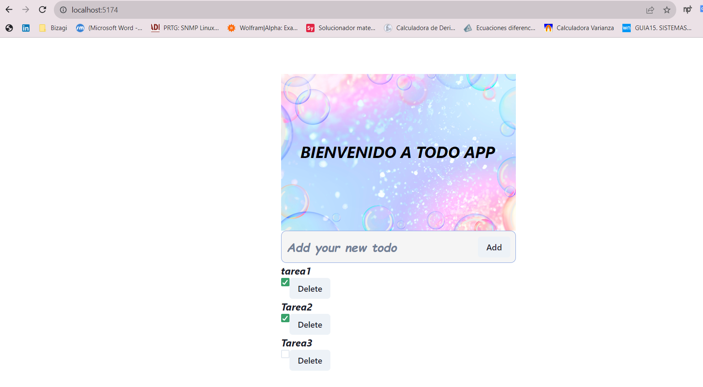

# React + Vite

This template provides a minimal setup to get React working in Vite with HMR and some ESLint rules.

Currently, two official plugins are available:

- [@vitejs/plugin-react](https://github.com/vitejs/vite-plugin-react/blob/main/packages/plugin-react/README.md) uses [Babel](https://babeljs.io/) for Fast Refresh
- [@vitejs/plugin-react-swc](https://github.com/vitejs/vite-plugin-react-swc) uses [SWC](https://swc.rs/) for Fast Refresh

### Project-1

En esta parte del laboratorio se implementaron  funcionalidades como: Agregar, eliminar y actualizar.

### Project-2

En esta parte del laboratorio se implementaron hooks para que la aplicación tuviera un estado pendiente o completo dependiendo de lo que escoja el usuario. Además, cada vez que se recargue la pagina la información va quedar guardada.

### Project-4

En esta parte del laboratorio se incluyo un formulario para crear una validación teniendo en cuenta que no se puedan guardar tareas en las cuales el nombre tenga menos de 3 caracteres y la descripción no debe ser obligatoria.

### Project-6

Aplicación actualizada con Chakra

